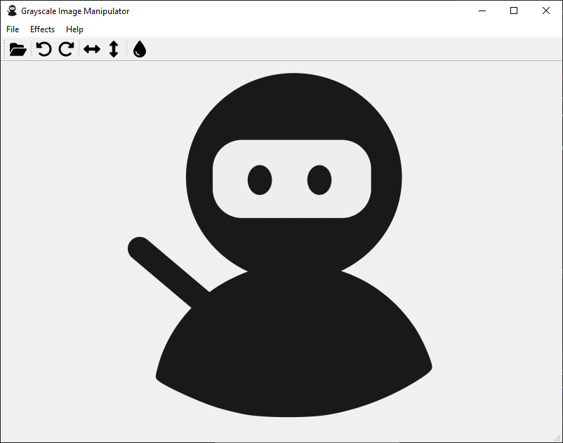

# qt-simple-image-manipulator
A project built using Qt6 for simple image manipulation. This project was meant to simply learn about using Qt framework and CMake.

Features currently supported:
- Rotate image
- Flip image
- Invert colour

# Requirements
- CMake >= 3.12
- [Qt6](https://www.qt.io/download) (You need to add QTDIR variable pointing to Qt installation directory in Environment Variables)

# Build
I'm using CMake GUI to configure and build the project and generating for Visual Studio 16 2019.

# Screenshot

# Attributions
This project is made possible with [Qt Framework](https://www.qt.io) and [Fontawesome](https://fontawesome.com).